# AudioStageMod

Minecraft 1.21.4 (Fabric) 用の舞台音響シミュレーター Mod です。
Yamaha CL5 デジタルミキサーや Rio ステージボックス、Meyer Sound のスピーカー群、
Galileo プロセッサーなどをゲーム内のブロック＋GUIとして再現し、
実際の舞台音響システムさながらの配線・パッチ・操作を体験できます。

## 主な機能

- **CL5 コンソール**：CHストリップ（フェーダー/ON/メーター）、SEL CH（EQ・ダイナミクス・ゲイン・ファンタム電源）、
  SCENE（300シーンの STORE/RECALL/UNDO）、PATCH（自動パッチ機能付き）、MONITOR（オシレーター/モニター出力）
- **Rio ステージボックス**：IN/OUTのゲイン・+48V・パッチ・ミュート操作
- **MultiBox**：チャンネルごとの IN/OUT 方向切り替え、Rioとの自動接続検出
- **Galileo プロセッサー**：8ch の DELAY / 3バンドEQ / LEVEL / MUTE、出力パッチ、プリセット保存
- **スピーカー（CQ-1 / PSW-2 / UPJ-1P / UPM）**：LEVEL / MUTE / POWER 操作と、配線に応じた実距離(最大300ブロック)でのサウンド再生
- **Hub（Luminex GigaSwitch）/ RME Digiface（Dante録音）**：ネットワーク配線状況の表示
- **ケーブルシステム**：XLR / マルチピン / Dante(CAT6) などケーブル種別ごとに接続可否を判定し、
  実際の配線を辿って信号経路（SignalFlow）を構築
- `/audiostage connect` `/audiostage disconnect` `/audiostage list` などのコマンド群

OSC連携は廃止し、すべてゲーム内の右クリックGUI操作で完結します。

## 動作環境

- Minecraft 1.21.4
- Fabric Loader 0.16.9 以降
- Fabric API（Yarn 1.21.4+build.1）

## インストール

1. [release/audiostage-0.1.0.jar](release/audiostage-0.1.0.jar) を `mods` フォルダに配置
2. Fabric Loader / Fabric API を導入したクライアント・サーバーで起動

## スクリーンショット

| CL5 メイン画面 |  CL5 GUI |
| --- | --- |
| 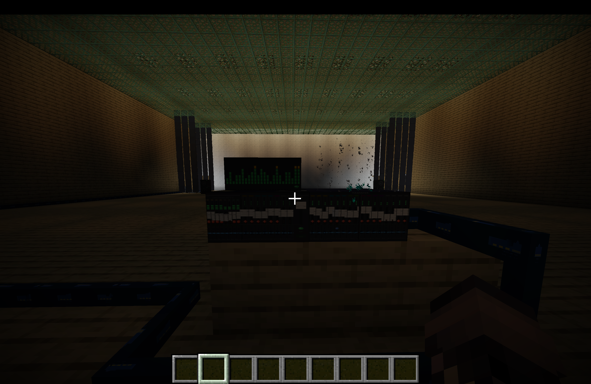 | 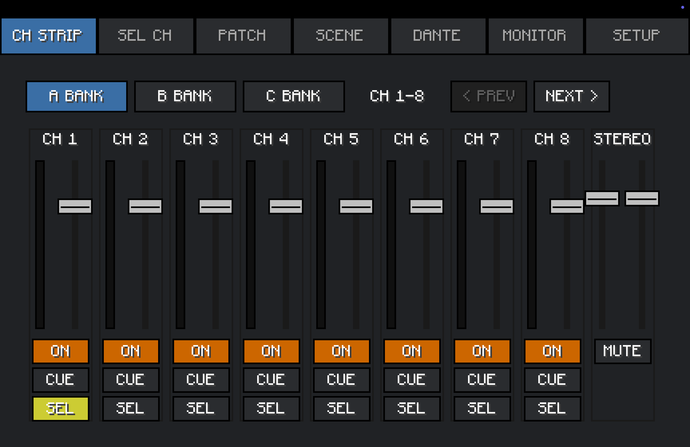 |

| CL5 GUI 各種 |
| --- |
| 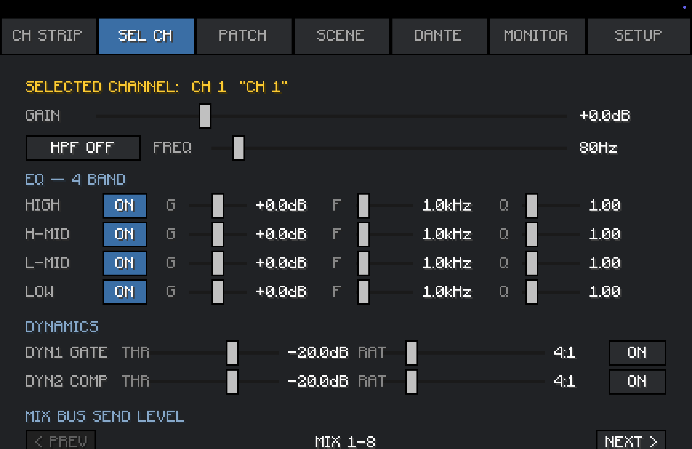 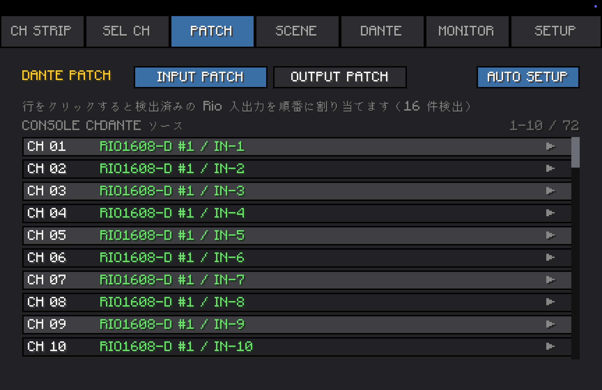 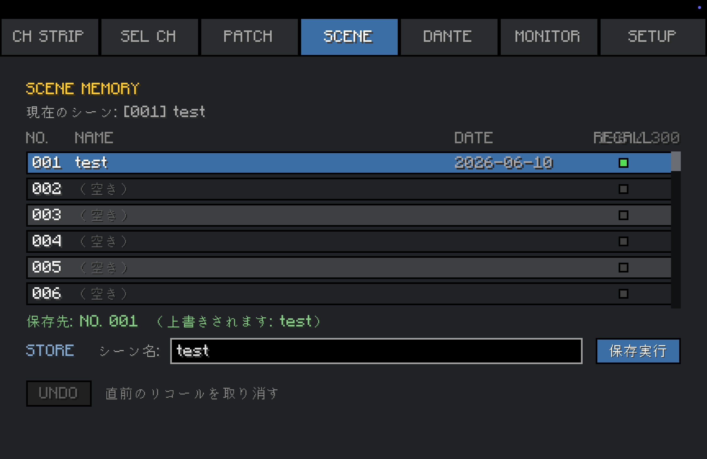 |
| 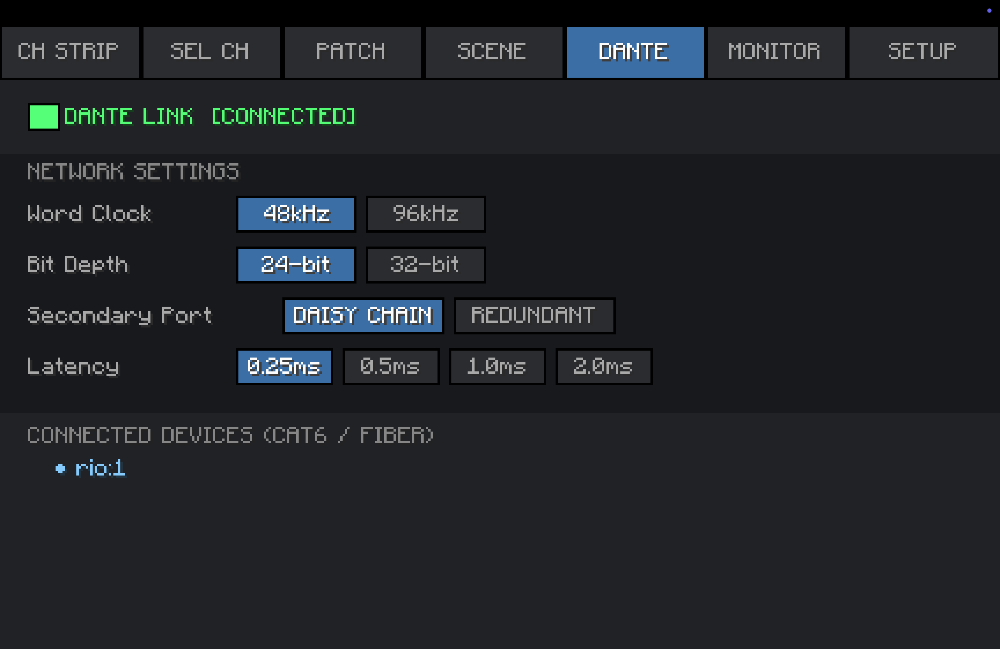 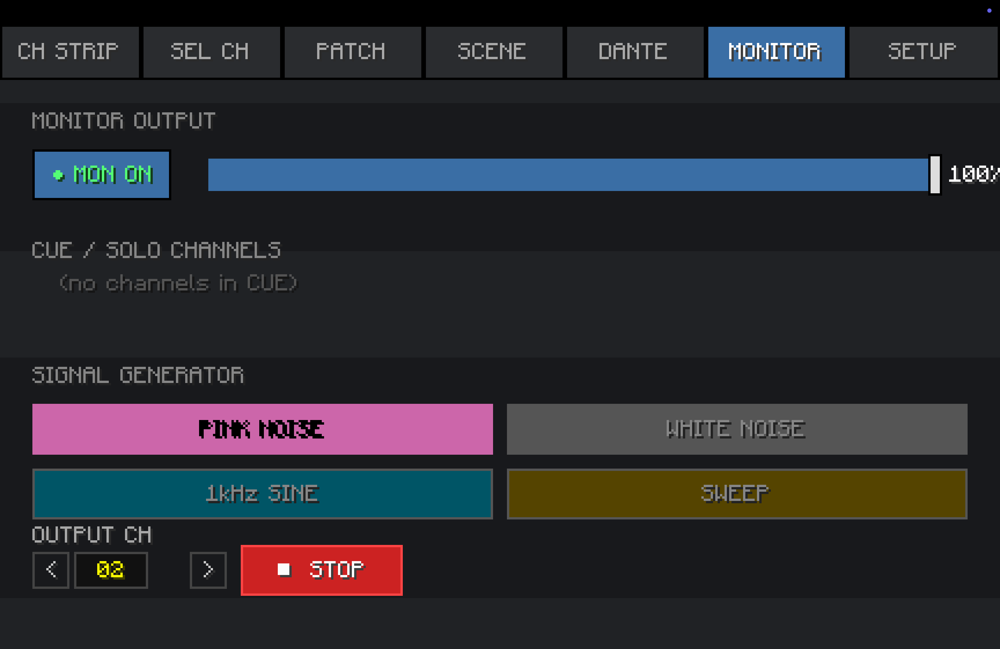 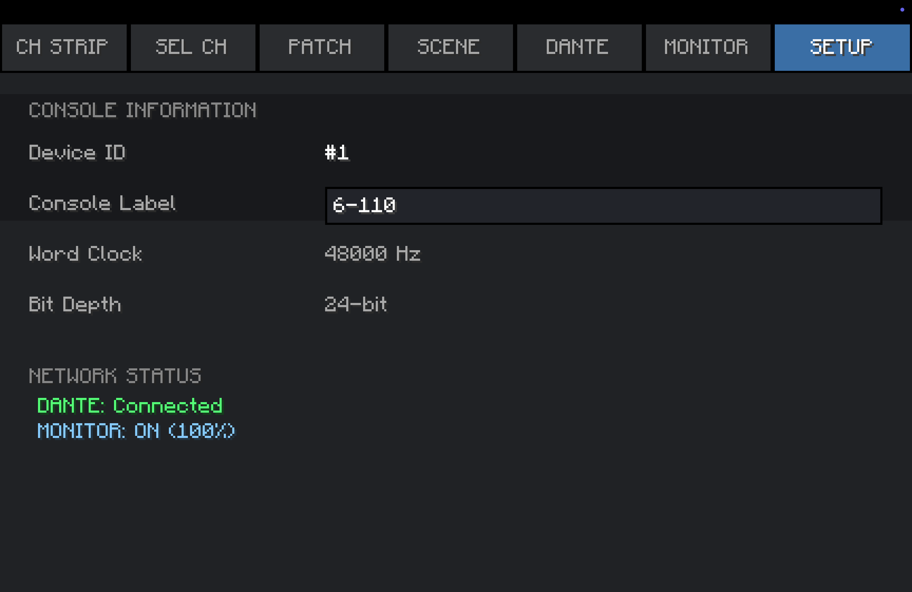 |

| Rio | MultiBox |
| --- | --- |
| 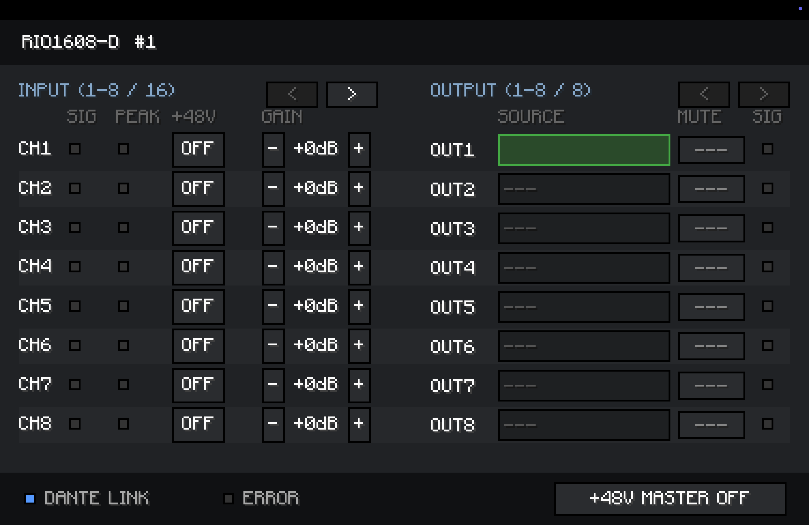 | 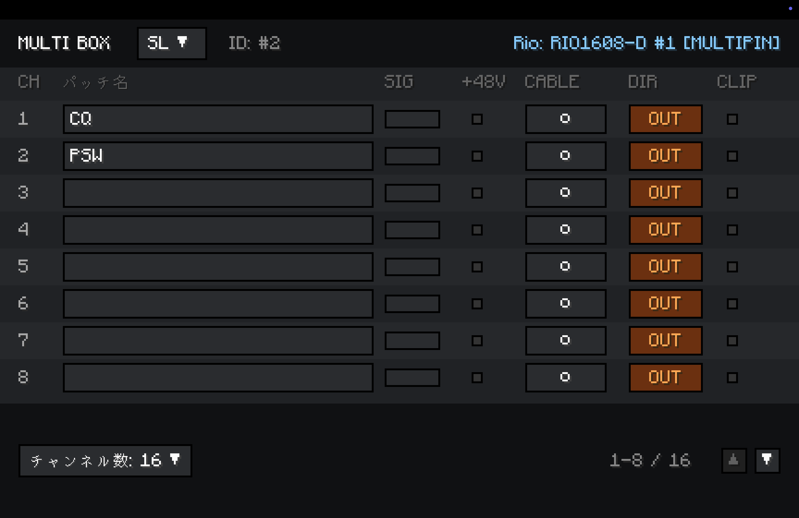 |

| MultiBox - Rio 接続 | スピーカー (CQ) |
| --- | --- |
| 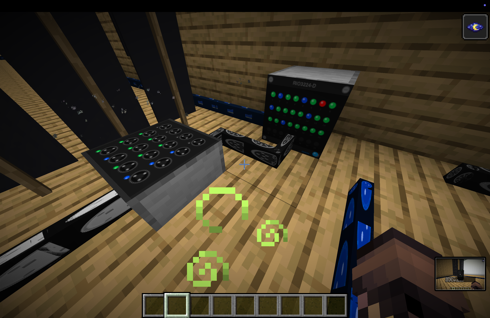 | 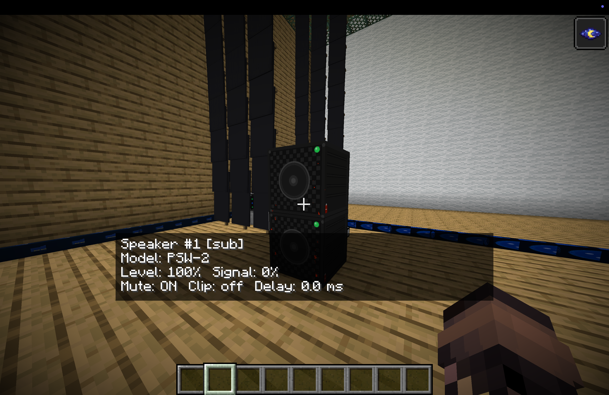 |

| RME Digiface |
| --- |
| 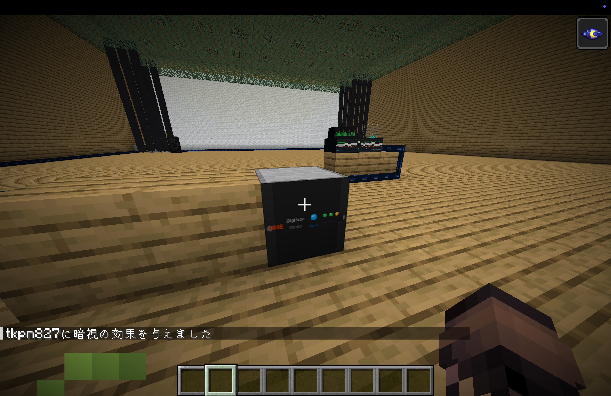 |

## ライセンス

個人利用・学習目的のプロジェクトです。
